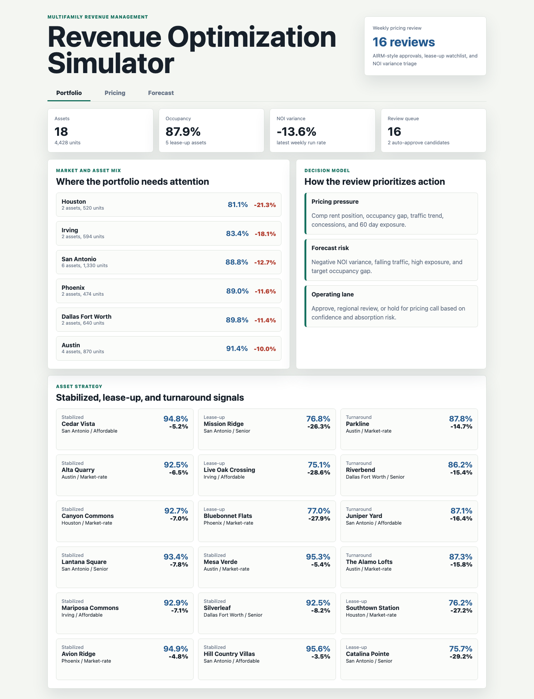
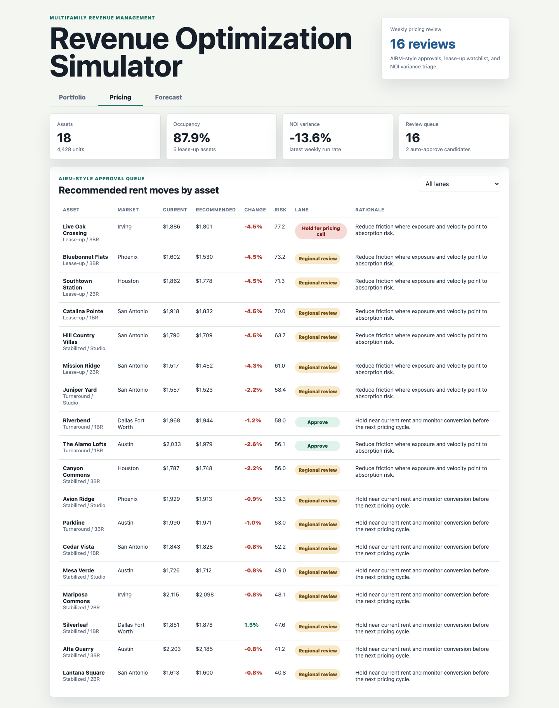
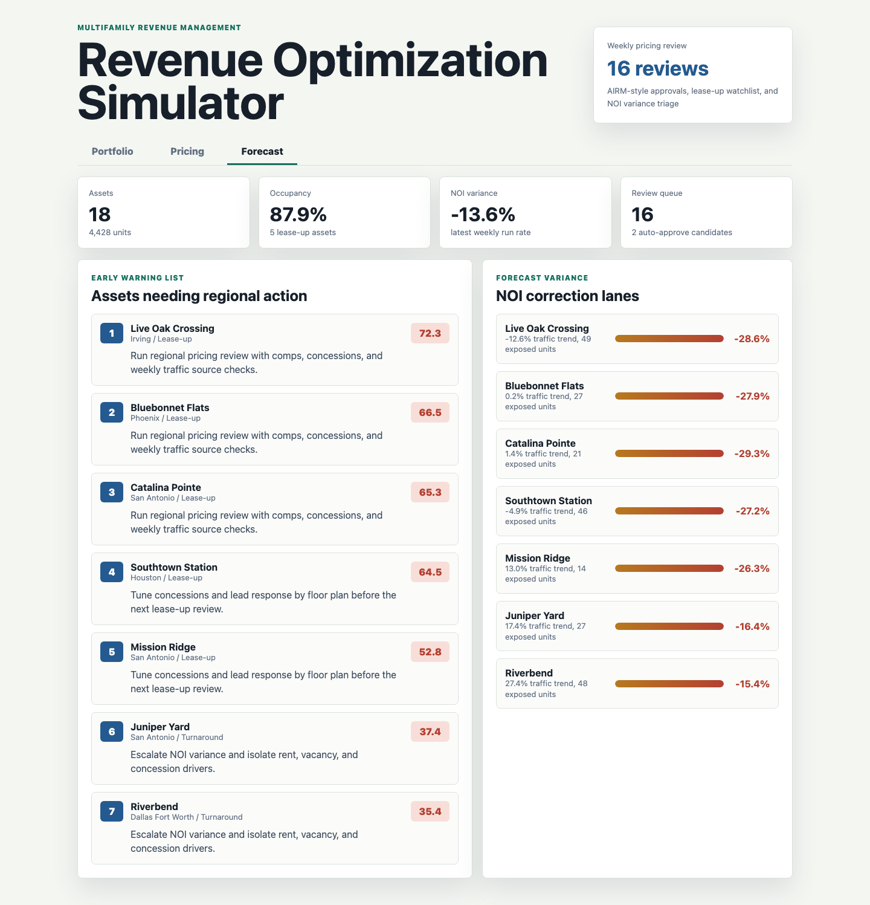

# Multifamily Revenue Optimization Simulator

A portfolio decision console for a multifamily owner, developer, and property management environment. The project models the weekly work of a revenue optimization analyst: review leasing velocity, traffic, exposure, concessions, comp position, pricing recommendations, and NOI variance before advising regional operations leaders.

This is not a generic dashboard. It is a role-specific artifact for pricing review, lease-up triage, and asset-level course correction.

## What It Shows

- A Texas and Southwest multifamily portfolio with stabilized, lease-up, and turnaround assets.
- A transparent pricing recommendation model that assigns each asset to an approval lane.
- A forecast watchlist that flags assets where occupancy gap, exposure, traffic trend, concessions, and NOI variance require regional action.
- SQL examples and generated outputs that make the analysis defensible in an interview.

## Screenshots



**Portfolio cockpit:** Market and asset-stage view for the weekly revenue review. It summarizes occupancy, NOI variance, review queue volume, market-level pressure, and the logic behind the prioritization model.



**Pricing approval simulator:** AIRM-style rent recommendation queue showing current rent, recommended rent, change percent, absorption risk, approval lane, and rationale for each asset.



**Forecast watchlist:** Regional action surface that ranks assets by early warning signals and separates pricing review work from lease-up and NOI correction work.

## Data

All data is synthetic and generated by `scripts/score_operating_data.py`. It does not represent real property performance.

Generated tables:

- `data/properties.csv`: 18 property assets with market, submarket, housing type, asset stage, units, regional manager, and strategy lane.
- `data/weekly_metrics.csv`: 288 property-week rows covering occupancy, availability, notices, traffic, tours, applications, signed leases, renewals, rent, concessions, exposure, budget NOI, and actual NOI.
- `data/market_comps.csv`: 288 comp-set rows covering comp effective rent, subject rent position, comp occupancy, traffic index, and new supply.
- `data/pricing_recommendations.csv`: 18 pricing recommendations with approval lane, confidence, absorption risk, expected NOI lift, and rationale.
- `analysis/outputs/forecast_watchlist.csv`: Ranked asset watchlist for regional follow-up.
- `analysis/outputs/summary.json`: Portfolio metrics used by the static app.

Generation method:

- Markets are modeled across San Antonio, Austin, Dallas Fort Worth, Houston, Irving, and Phoenix.
- Stabilized assets center near 94 percent occupancy, lease-up assets center near 74 percent with gradual improvement, and turnaround assets center near 88 percent.
- Traffic, tours, applications, signed leases, and renewals are derived from availability, demand factor, and conversion ranges.
- Rent and concessions vary by market rent factor, asset stage, occupancy, and 60 day exposure.
- Pricing movement responds to comp rent position, target occupancy gap, traffic trend, concessions, and exposure.
- Watchlist priority rises with target occupancy gap, negative NOI variance, exposure, concessions, and falling traffic.

## Role Connection

This artifact demonstrates the work expected of a revenue optimization analyst in multifamily housing:

- Analyze weekly leasing, traffic, pricing, and NOI trends.
- Translate data into clear recommendations for regional property managers.
- Evaluate comps and demand signals before approving rent changes.
- Support both lease-up and stabilized assets.
- Identify negative forecast trends early enough for corrective action.
- Explain pricing decisions in a revenue-management system context.

## Scope

What this project does:

- Produces synthetic multifamily operating data and analysis outputs.
- Renders three distinct decision surfaces in a static web app.
- Documents the data model, SQL checks, and scoring logic.
- Gives an interview-ready narrative for pricing, absorption, and NOI review.

What this project does not do:

- It does not connect to live property management, revenue management, or accounting systems.
- It does not claim to forecast real property performance.
- It does not replace a production pricing system or underwrite actual rent decisions.

## Run Locally

```bash
npm run analyze
npm run start
```

Then open `http://127.0.0.1:4173`.
